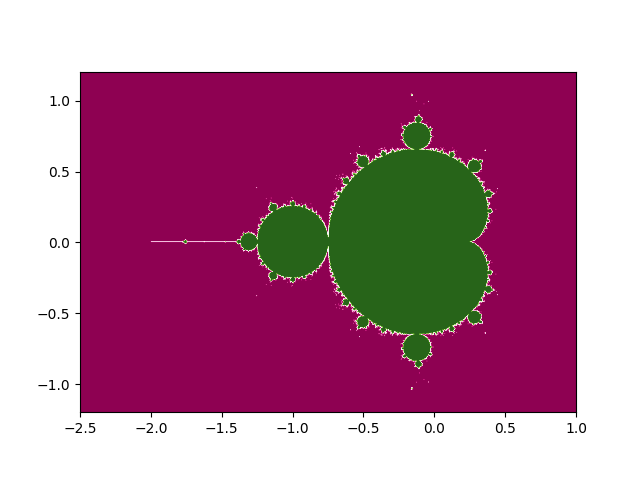
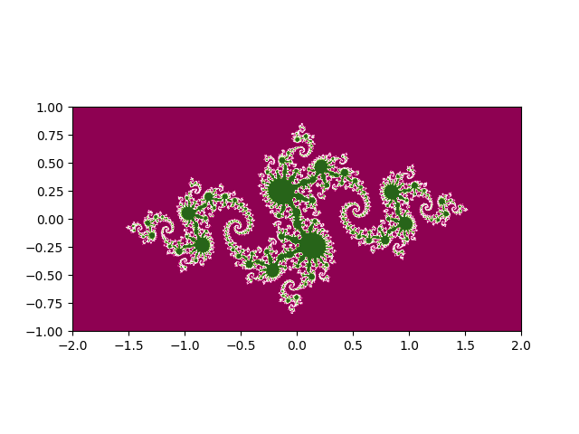

# いろいろなフラクタル　with Python

## 目次
1. [フラクタルとは?](#フラクタルとは?)
2. [マンデルブロ集合](#マンデルブロ集合と)
3. [ジュリア集合](#ジュリア集合)
4. [バーンズリーのシダ](#バーンズリーのシダ)
5. [参考](#参考)

## フラクタルとは?
フラクタルとは幾何学の概念で、図形の部分が全体から再帰的になっている図形一般を指す。自己相似的とも呼ばれる。
https://en.wikipedia.org/wiki/Fractal

## マンデルブロ集合
ある漸化式に対して、極限が収束するような定数項cからなる集合を考える
この集合を複素平面上に描画すると、フラクタル図形が現れる\
https://en.wikipedia.org/wiki/Mandelbrot_set

## ジュリア集合
ある漸化式に対して、極限が収束するような初項からなる集合を複素平面上に描画すると、定数の選び方によって、さまざまなフラクタル図形が現れることがある。
特に、定数Cがフラクタル集合に含まれる場合において、ジュリア集合が美しいフラクタル構造をとる場合が多い。
以下はC=-0.8+0.156iの時のジュリア集合である（下画像）。他にも、
- C=-0.4+0.6i
- C=0.37+0.1i

の場合などに美しいフラクタル構造をとる。

## バーンズリーのシダ
coming soon...

## 参考
https://x.com/i/bookmarks?post_id=1832058136976625733