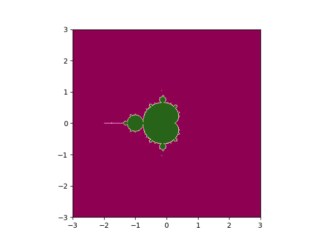

# マンデルブロ集合の描画　with Python

## マンデルブロ集合とは？
ある漸化式に対して、極限が収束するような定数項cからなる集合を考える
この集合を複素平面上に描画すると、フラクタル図形が現れる

詳しくは以下を参照\
[マンデルブロ集合とは](https://en.wikipedia.org/wiki/Mandelbrot_set)\
[フラクタルとは](https://en.wikipedia.org/wiki/Fractal)

## 例

実際には、main.pyを実行して出力されたmatplotlibのwindow内で、描画された図形の周を拡大すると、フラクタル構造が確認できる
